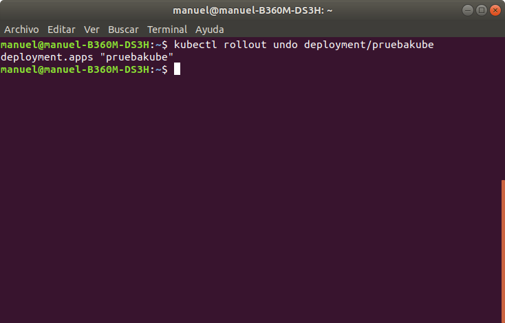

**Project: “Cloud Computing in European schools”**  

 Number: Project: 2019-4-ES01-KA202-038471

   

# Introducción a PaaS: desarrollar, implementar, ejecutar y administrar aplicaciones en la nube
  

#### Disclaimer
&nbsp;&nbsp;&nbsp;  *"El apoyo de la Comisión Europea para la producción de esta publicación no constituye una aprobación de los contenidos que refleje únicamente las opiniones de los autores, y la Comisión no se hace responsable del uso que pueda hacerse de la información contenida en el mismo."*

#### Autores

&nbsp;&nbsp;&nbsp;  Este trabajo está realizado por Manuel Santos, José Antonio Busto, José María Parrilla y Víctor López bajo la licencia Creative Commons :  
  

### Objetivo
&nbsp;&nbsp;&nbsp; Plataforma como servicio(PaaS), es un modelo de computación en la nube que permite a los usuarios desarrollar, implementar, ejecutar y administrar aplicaciones sin preocuparse por las capas subyacentes. Las alternativas utilizadas hoy se centran en el uso de contenedores que promueven el enfoque de desarrollo de **aplicaciones basado en microservicios** (frente a **aplicaciones monolíticas**), ya que los diferentes servicios en los que estamos separados de la aplicación pueden ejecutarse fácilmente en diferentes contenedores. Realizaremos un estudio de Docker, Kubernetes y OpenShift para desarrollar, implementar, ejecutar y administrar aplicaciones basadas en microservicios.

&nbsp;&nbsp;&nbsp; Esta actividad ha sido desarrollada para desarrollar la competencia profesional incluida en el proyecto Erasmus + "Cloud Computing en escuelas europeas".

## Indice
- Instalación de Minikube y Kubectl
- Tolerancia a fallos
- Escalabilidad
- Balanceo de Cargas
- Actualizaciones
- Rollback 
- Enrutando nuestra aplicación

 

<h1>Kubernetes</h1>
 

En el documento anterior hablamos sobre Docker pero en este caso vamos a hablar sobre Kubernetes.

Kubernetes es un orquestador de contenedores de aplicación escrito en Go y con licencia Apache-2.0, fue lanzado el 21 de julio de 2015 por Google que rápidamente se alió con la Linux Foundation para crear la Cloud Native Computing Foundation (CNCF) y dejó el proyecto en sus manos.

Ahora pasaremos a explicar como descargarlo y usarlo de forma adecuada.

 
<h2>Instalación de Minikube y Kubectl</h2>

Minikube es una versión ligera de Kubernetes, por lo que usaremos Minikube para trabajar. Primero tenemos que descargarlo, después le daremos los permisos correspondientes, haremos una copia a la ruta de carpetas /usr/local/bin/ y por último, se muestra como podemos borrar Minikube:

 

 

Ahora en la siguiente captura hacemos lo mismo pero con Kubectl, es decir, descargar, dar permisos, copiarlo a la misma ruta y como borrarlo:

 

 

Una vez descargado Minikube arrancamos la máquina con el comando de la siguiente imagen:

 
 
 

En la siguiente captura podemos comprobar el número de nodos que tenemos(en este caso, el nodo que tenemos actualmente) y aparece clasificado por los siguientes datos: Nombre, Status, Roles, Age y Version.

 

Por último, en este punto para añadir el componente ingress deberemos poner la siguiente línea de comando:

 

<h2>Tolerancia a fallos</h2>

Un POD es un grupo de: una dirección "IP", una o más aplicaciones y uno o  más volúmenes.Representa una unidad que puede realizar una tarea / servicio.

 
Creamos un Pod para meter nuestra aplicación web

 
Podemos comprobar el número de Pods con el siguiente comando

 
Si eliminamos el pod con el siguiente comando nos podemos dar cuenta de que Kubernetes 
nos crea automáticamente otro pod

 

Utilizamos el siguiente comando para comprobar el recurso deployment:

 

 

Y por último ejecutaremos el siguiente comando para comprobar el recurso  ReplicaSet
 

<h2>Escalabilidad</h2>

RepiclateSet nos permite replicar los pods. Nosotros utilizaremos el siguiente  comando para replicar los pods:
 

 

Con el siguiente comando comprobaremos cómo se han creado los 4 pods en base  al primero y que cada uno se está ejecutando en un nodo diferente:
 

 

<h2>Balanceo de carga</h2>

Crearemos un recurso Servicio para acceder a la aplicación que vamos a crear,  mediante el siguiente comando:
 

 

Ahora comprobaremos el puerto y la ip asignada de nuestra aplicación con los  siguientes comandos:
 

 

Por último comprobaremos que accede correctamente a nuestra aplicación  introduciendo la ip y el puerto
 

 

<h2>Actualizaciones</h2>
Si queremos actualizar nuestra aplicación , después de hacer los cambios correspondientes y subirlo a la Web DockerHub basta con poner este el siguiente comando

 
En esta imagen podremos observar si se ha actualizado nuestra aplicación 
 
<h2>Rollback</h2>
Si queremos volver a la versión anterior solo bastará con hacer un rollback

 
<h2>Enrutando nuestra aplicación</h2>
Para enrutar nuestra aplicación previamente creamos el archivo

 
Configuramos el archivo ingress.yaml 

 
Creamos el recurso Ingress

 
Comprobamos el recurso creado

Finalmente comprobamos su funcionamiento

 

